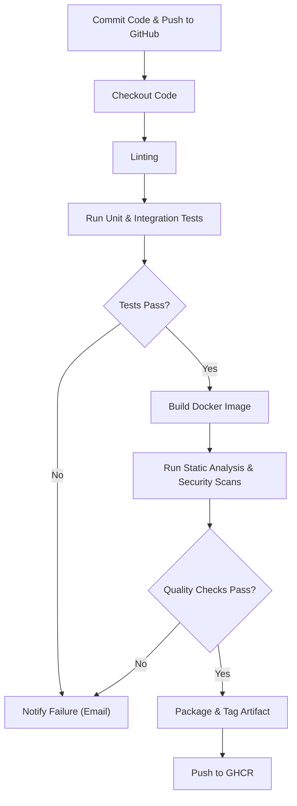

### How It Works
1. **Commit & Push:** The pipeline is triggered when code is committed and pushed to GitHub.
2. **Checkout:** The CI system checks out the code.
3. **Linting:** Code quality is enforced through linting.
4. **Testing:** Unit and integration tests run, with a decision node ensuring that failures are caught early.
5. **Build:** If tests pass, the Docker image is built.
6. **Static Analysis & Security:** The built image undergoes static analysis and security scans.
7. **Quality Gate:** A decision node checks whether quality metrics (e.g., code coverage, analysis results) meet the set standards.
8. **Packaging:** Successful quality checks lead to packaging and artifact tagging.
9. **Pushing:** The image will be pushed on ghcr
10. **Notifications:** The pipeline notifies success or failure via Email.